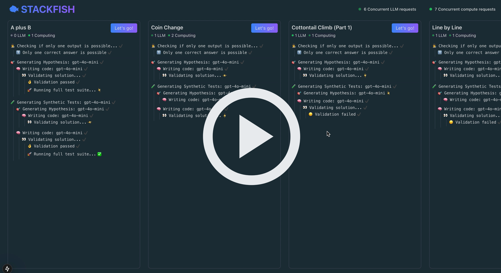

# 🐟 Stackfish - Competitive Programming Solver

**Stackfish** is an open-source LLM-powered pipeline designed to automatically solve competitive programming problems. This pipeline got the highest ranking in the final round of [2024 Hacker Cup AI Closed Track](https://www.facebook.com/codingcompetitions/hacker-cup/2024/final-round/scoreboard?track=AI_CLOSED_TRACK), successfully solving 2 out of the 6 problems.

[](https://www.youtube.com/watch?v=yPXMvMmeemU)
(See demo of GPT-4o-mini solving a bunch of problems. For harder problems, o1-mini is recommended.)

## How It Works

1. **Generate Extra Tests:** The LLM reads the problem and creates additional sample tests to cover corner cases.
2. **Form a Hypothesis:** The LLM suggest a verbal solution approach.
3. **RAG:** The LLM retrieves relevant code snippets of advanced algorithms/data structures from a curated library.
4. **Coding:** The LLM writes a C++ solution.
5. **QA & Retry:** The solution is tested against sample tests. If it fails, the LLM revises until it works.
6. **Full Execution:** Once tests pass, it’s run on the full input set.

## Tech Stack

- **Front-end:** Next.js app to manage parallel agents and monitor progress.
- **LLMs:** OpenAI (e.g. GPT) or Llama 3.3, Qwen 32B via Together.ai.
- **Compute & Testing:** Google Cloud Run to safely run and validate solutions at scale.

## Repo Structure

- `./www` - Next.js control panel/front-end
- `./cloud-run-worker` - Container for Google Cloud Run to execute code in the cloud
- `./PROBLEMS` - Problems in Hacker Cup format (`statement.txt`, `sample_in.txt`, `sample_out.txt`, `full_in.txt`)
- `./SOLUTIONS` - Automatically generated solutions placed here
- `./www/app/services/algo_rag_data` - Implementation of ~200 advanced algorithms/data structures, collected from various sources.

## Getting Started

1. **Set Keys:**
   - Add `OPENAI_API_KEY` or `TOGETHER_API_KEY` in `www/config.env`.
2. **Problems Setup:**

   - Put your Hacker Cup-format problems into `./PROBLEMS/` (see examples)

3. **Run Locally:**

   ```bash
   cd www
   npm install
   npm run dev
   ```

   Then open http://localhost:3000.

4. **Launch Agents:**

   - Select a problem from the list
   - Click "Let's go!" to start
   - Multiple agents will work in parallel to solve it

5. **Models & Config:**

   - Default model: GPT-4o-mini
   - See `www/app/config.ts` to:
     - Switch between different LLM models
     - Adjust agent settings and parameters

6. **Scale with Cloud Run:**
   - For higher rate limits and better scaling, deploy your own worker
   - Follow setup guide in `./cloud-run-worker/README.md`

Enjoy, and happy hacking! 🐟
